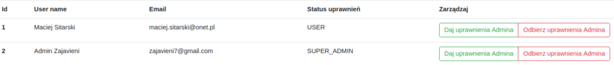

# 3city events
> The application has been designed as ticket booking system for cultural events.

## Table of contents
* [General info](#general-info)
* [Features](#features)
* [Technologies](#technologies)
* [Status](#status)
* [Inspiration](#inspiration)

## General info
>The main feature of the application is booking system. The application has information about events took place in Gdańsk and the surrounding area which was download from remote REST API service (http://isa-proxy.blueazurit.com/gdansk-events/events.json?). An unregistered user has the ability to view available events, search for specific events and organizers, and have the option of logging into the site using authentication process through a Google account using OAuth 2.0 and authorization. 
Logged users can book tickets for events and manage their favorite events. Administrators can giving previlieges to user to load data from json backup if API doesn't response.

## Features

### User authentication and authorization
> Access to individual functionalities depends on the user's authorization, the application has three levels of authorization: 
guest, user and administrator.
The Google Oauth Authentication system has been added in the application, when the user exists in the database logs into 
his account, when he does not exist he is added to the database. 
By logging in, the user is checked the authorization level and access to individual functionalities.

### Guest view
 
> Guests have the opportunity to enjoy all available events. They also have the option of using the advanced search, thanks to which they will find interesting events by the name of the organizer or by entering the first 3 letters of the event.

 
>In addition, guests can also go into the details of each event, where they can learn specific information
### Users view
 
> The logged in user, in addition to functionalities regarding guests, also have additional features. One of them is the ability to add selected events to favorites and delete them. In addition, each time you log in, a bar with the nearest favorite event is displayed on each view. The user can close this bar, which will disappear until logging out.

 
> The second key functionality for the application is the ability to book tickets for selected events. When booking an event, it is added to the list of reserved events. The user can delete a reservation at any time.

### Admin view

> Administrators have access to the full list of users. In addition, they can grant and revoke privileges.

 > In the administrator's management panel there is a functionality that allows you to read events data from the JSON file. All data are stored in MySQL database after loading. This functionality has been implemented as an alternative to retrieving events data directly from the API.

> Another option available to administrator is access to statistics module where events data are presented. There are three charts:
* Most visited events
* TOP 10 organizers
* Events most often added to favorites
> Statistics are generated from database and present current data (effect reached by AJAX).

### E-mail scheduler

> In the background of our application there is a scheduler which check the validity of events in every 15 minutes and automatically sends an email informing users who have a given event booked or added to their favorites that the event has expired. In addition, when the user reserves or cancels information, an email will also be sent with this information to confirm the operation.

### Loggers
> Every operation that is being made on the backend is logged to server logs or to external file - depending on the logger level.

## Technologies
* Java SE 12
* Java EE 8
* MySQL 8.0.15
* Hibernate ORM 5.4.2
* FasterXML/Jackson 2.9.10
* REST API
* Docker
* Wildfly 17.0.1
* Maven 3.3.9
* Jenkins CI/CD
* OAuth 2.0
* SLF4J 1.7.28
* Freemarker 2.3.29
* Bootstrap 4.3.1
* HTML5, CSS3, JS
* jQuery, AJAX
* Google Charts

## Status
Project is: _finished_.

## Inspiration
The project has been created during a Java course at infoShare Academy in Gdańsk.

